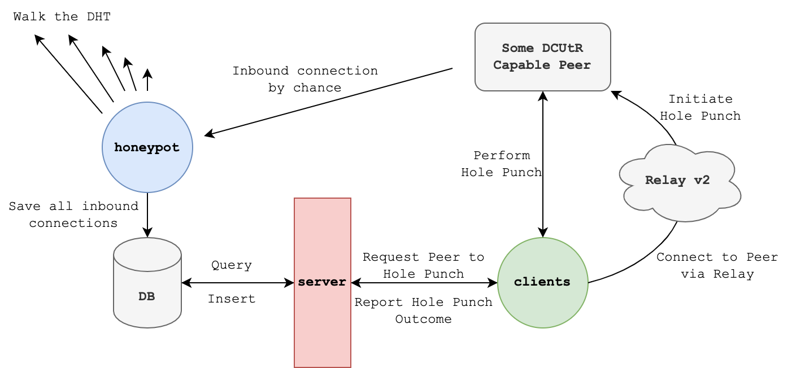

# Punchr

[](https://github.com/RichardLitt/standard-readme)

> **Note**
>
> We are running a hole punching week from the **5th to the 12th of December 2022**. [**Register here**](https://forms.gle/ueNS5iGQup6oszCQ8) and contribute to this research project.

This repo contains components to measure [Direct Connection Upgrade through Relay (DCUtR)](https://github.com/libp2p/specs/blob/master/relay/DCUtR.md) performance.

Specifically, this repo contains:

1. A honeypot that tries to attract DCUtR capable peers behind NATs.
2. A gRPC server that exposes found peers and tracks hole punching results.
3. A hole punching client that fetches DCUtR capable peers from the API server, performs a hole punch to them and reports the result back.

**Dashboards:**

- [`Health Dashboard`](https://punchr.dtrautwein.eu/grafana/d/43l1QaC7z/punchr-health)
- [`Performance Dashboard`](https://punchr.dtrautwein.eu/grafana/d/F8qg0DP7k/punchr-performance)

**Want to participate?**

- [Register here](https://forms.gle/ueNS5iGQup6oszCQ8)

# Table of Contents <!-- omit in toc -->
- [Background](#background)
- [Outcomes](#outcomes)
  - [Hole Punch Outcomes](#hole-punch-outcomes)
  - [Hole Punch Attempt Outcomes](#hole-punch-attempt-outcomes)
- [Components](#components)
  - [`honeypot`](#honeypot)
  - [`server`](#server)
  - [`go-client`](#go-client)
  - [`rust-client`](#rust-client)
- [Install](#install)
- [Development](#development)
- [Deployment](#deployment)
  - [Clients](#clients)
    - [RaspberryPi](#raspberrypi)
    - [NixOS](#nixos)
- [Server](#server)
- [Honeypot](#honeypot)
- [Release](#release)
  - [go-client](#go-client)
- [Maintainers](#maintainers)
- [Contributing](#contributing)
- [License](#license)

# Background



The goal is to measure the hole punching success rate. For that, we are using a **honeypot** to attract inbound connections from DCUtR capable peers behind NATs. These are then saved into a database which get served to hole punching **clients** via a **server** component. The hole punching clients ask the server if it knows about DCUtR capable peers. If it does the clients connect to the remote peer via a relay and waits for the remote to initiate a hole punch. The result is reported back to the server.

# Outcomes

## Hole Punch Outcomes

1. `UNKNOWN` - There was no information why and how the hole punch completed
2. `NO_CONNECTION` - The client could not connect to the remote peer via any of the provided multi addresses. At the moment this is just a single relay multi address.
3. `NO_STREAM` - The client could connect to the remote peer via any of the provided multi addresses but no `/libp2p/dcutr` stream was opened within 15s. That stream is necessary to perform the hole punch.
4. `CONNECTION_REVERSED` - The client only used one or more relay multi addresses to connect to the remote peer, the `/libp2p/dcutr` stream was not opened within 15s, and we still end up with a direct connection. This means the remote peer succesfully reversed it.
5. `CANCELLED` - The user stopped the client (also returned by the rust client for quic multi addresses)
6. `FAILED` - The hole punch was attempted multiple times but none succeeded OR the `/libp2p/dcutr` was opened but we have not received the internal start event OR there was a general protocol error.
7. `SUCCESS` - Any of the three hole punch attempts succeeded.

## Hole Punch Attempt Outcomes

Any connection to a remote peer can consist of multiple attempts to hole punch a direct connection. Each individual attempt could yield the following outcomes:

1. `UNKNWON` - There was no information why and how the hole punch attempt completed
2. `DIRECT_DIAL` - The connection reversal from our side succeeded (should never happen)
3. `PROTOCOL_ERROR` - This can happen if e.g., the stream was reset mid-flight
4. `CANCELLED` - The user stopped the client
5. `TIMEOUT` - We waited for the internal start event for 15s but timed out
6. `FAILED` - We exchanged `CONNECT` and `SYNC` messages on the `/libp2p/dcutr` stream but the final direct connection attempt failed -> the hole punch was unsuccessful
7. `SUCCESS` - We were able to directly connect to the remote peer.

# Components

## `honeypot`

The honeypot operates as a DHT server and periodically walks the complete DHT to announce itself to the network. The idea is that other peers add the honeypot to their routing table. This increases the chances of peers behind NATs passing by the honeypot when they request information from the DHT network.

When the honeypot registers an inbound connection it waits until the `identify` protocol has finished and saves the following information about the remote peer to the database: PeerID, agent version, supported protocols, listen multi addresses.

Help output:

```
NAME:
   honeypot - A libp2p host allowing unlimited inbound connections.

USAGE:
   honeypot [global options] command [command options] [arguments...]

VERSION:
   dev+

COMMANDS:
   help, h  Shows a list of commands or help for one command

GLOBAL OPTIONS:
   --crawler-count value   The number of parallel crawlers (default: 10) [$PUNCHR_HONEYPOT_CRAWLER_COUNT]
   --db-host value         On which host address can the database be reached (default: localhost) [$PUNCHR_HONEYPOT_DATABASE_HOST]
   --db-name value         The name of the database to use (default: punchr) [$PUNCHR_HONEYPOT_DATABASE_NAME]
   --db-password value     The password for the database to use (default: password) [$PUNCHR_HONEYPOT_DATABASE_PASSWORD]
   --db-port value         On which port can the database be reached (default: 5432) [$PUNCHR_HONEYPOT_DATABASE_PORT]
   --db-sslmode value      The sslmode to use when connecting the the database (default: disable) [$PUNCHR_HONEYPOT_DATABASE_SSL_MODE]
   --db-user value         The user with which to access the database to use (default: punchr) [$PUNCHR_HONEYPOT_DATABASE_USER]
   --help, -h              show help (default: false)
   --key FILE              Load private key for peer ID from FILE (default: honeypot.key) [$PUNCHR_HONEYPOT_KEY_FILE]
   --port value            On which port should the libp2p host listen (default: 11000) [$PUNCHR_HONEYPOT_PORT]
   --telemetry-host value  To which network address should the telemetry (prometheus, pprof) server bind (default: localhost) [$PUNCHR_HONEYPOT_TELEMETRY_HOST]
   --telemetry-port value  On which port should the telemetry (prometheus, pprof) server listen (default: 11001) [$PUNCHR_HONEYPOT_TELEMETRY_PORT]
   --version, -v           print the version (default: false)
```
## `server`

The server exposes a gRPC api that allows clients to query for recently seen NAT'ed DCUtR capable peers that can be probed and then report the result of the hole punching process back.

Help output:

```text
NAME:
   punchrserver - A gRPC server that exposes peers to hole punch and tracks the results.

USAGE:
   punchrserver [global options] command [command options] [arguments...]

VERSION:
   dev+

COMMANDS:
   help, h  Shows a list of commands or help for one command

GLOBAL OPTIONS:
   --db-host value         On which host address can the database be reached (default: localhost) [$PUNCHR_SERVER_DATABASE_HOST]
   --db-name value         The name of the database to use (default: punchr) [$PUNCHR_SERVER_DATABASE_NAME]
   --db-password value     The password for the database to use (default: password) [$PUNCHR_SERVER_DATABASE_PASSWORD]
   --db-port value         On which port can the database be reached (default: 5432) [$PUNCHR_SERVER_DATABASE_PORT]
   --db-sslmode value      The sslmode to use when connecting the the database (default: disable) [$PUNCHR_SERVER_DATABASE_SSL_MODE]
   --db-user value         The user with which to access the database to use (default: punchr) [$PUNCHR_SERVER_DATABASE_USER]
   --help, -h              show help (default: false)
   --port value            On which port should the gRPC host listen (default: 10000) [$PUNCHR_SERVER_PORT]
   --telemetry-host value  To which network address should the telemetry (prometheus, pprof) server bind (default: localhost) [$PUNCHR_SERVER_TELEMETRY_HOST]
   --telemetry-port value  On which port should the telemetry (prometheus, pprof) server listen (default: 10001) [$PUNCHR_SERVER_TELEMETRY_PORT]
   --version, -v           print the version (default: false)
```

## `go-client`

The client announces itself to the server and then periodically queries the server for peers to hole punch. If the server returns address information the client connects to the remote peer via the relay and waits for the remote to initiate a hole punch. Finally, the outcome gets reported back to the server.

Help output:
```text
NAME:
   punchrclient - A libp2p host that is capable of DCUtR.

USAGE:
   punchrclient [global options] command [command options] [arguments...]

VERSION:
   dev+

COMMANDS:
   help, h  Shows a list of commands or help for one command

GLOBAL OPTIONS:
   --api-key value           The key to authenticate against the API [$PUNCHR_CLIENT_API_KEY]
   --bootstrap-peers value   Comma separated list of multi addresses of bootstrap peers  (accepts multiple inputs) [$NEBULA_BOOTSTRAP_PEERS]
   --help, -h                show help (default: false)
   --host-count value        How many libp2p hosts should be used to hole punch (default: 10) [$PUNCHR_CLIENT_HOST_COUNT]
   --key-file value          File where punchr saves the host identities. (default: punchrclient.keys) [$PUNCHR_CLIENT_KEY_FILE]
   --server-host value       Where does the the punchr server listen (default: punchr.dtrautwein.eu) [$PUNCHR_CLIENT_SERVER_HOST]
   --server-port value       On which port listens the punchr server (default: 443) [$PUNCHR_CLIENT_SERVER_PORT]
   --server-ssl              Whether or not to use a SSL connection to the server. (default: true) [$PUNCHR_CLIENT_SERVER_SSL]
   --server-ssl-skip-verify  Whether or not to skip SSL certificate verification. (default: false) [$PUNCHR_CLIENT_SERVER_SSL_SKIP_VERIFY]
   --telemetry-host value    To which network address should the telemetry (prometheus, pprof) server bind (default: localhost) [$PUNCHR_CLIENT_TELEMETRY_HOST]
   --telemetry-port value    On which port should the telemetry (prometheus, pprof) server listen (default: 12001) [$PUNCHR_CLIENT_TELEMETRY_PORT]
   --version, -v             print the version (default: false)
```

Resource requirements:

- `Storage` - `~35MB`
- `Memory` - `~100MB`
- `CPU` - `~2.5%`

## `rust-client`

Rust implementation of the punchr client.

Help output:
```
Rust Punchr Client 0.1.0

USAGE:
    rust-client [OPTIONS]

OPTIONS:
    -h, --help                         Print help information
        --pem <PATH_TO_PEM_FILE>       Path to PEM encoded CA certificate against which the server's
                                       TLS certificate is verified [default: hardcoded CA
                                       certificate for punchr.dtrautwein.eu]
        --rounds <NUMBER_OF_ROUNDS>    Only run a fixed number of rounds
        --seed <SECRET_KEY_SEED>       Fixed value to generate a deterministic peer id
        --server <SERVER_URL>          URL and port of the punchr server. Note that the scheme ist
                                       required [default: https://punchr.dtrautwein.eu:443]
    -V, --version                      Print version information

Note: The api key for authentication is read from env value "API_KEY".
```

Resource requirements:

- `Storage` - `~12MB`
- `Memory` - `~20MB`
- `CPU` - `~0.2%`

# Install

Head over to the [GitHub releases page](https://github.com/dennis-tra/punchr/releases) and download the appropriate binary or compile it yourself. 
Run `make build` and find the executables in the `dist` folder. When running the honeypot or server the database migrations folder `./migrations` needs to be in the working directory of either process.

The honeypot listens on port `10000`, the server on port `11000` and clients on `12000`. All components expose prometheus and pprof telemetry on `10001`, `11001`, and `12001` respectively.

# Development

Run `make tools` to install all necessary tools for code generation (protobuf and database models). Specifically, this will run:

```shell
go install -tags 'postgres' github.com/golang-migrate/migrate/v4/cmd/migrate@v4.14.1
go install github.com/volatiletech/sqlboiler/v4@v4.6.0
go install github.com/volatiletech/sqlboiler/v4/drivers/sqlboiler-psql@v4.6.0
go install google.golang.org/protobuf/cmd/protoc-gen-go@latest
go install google.golang.org/grpc/cmd/protoc-gen-go-grpc@latest
```

Then start the database with `make database` or run:

```shell
docker run --rm -p 5432:5432 -e POSTGRES_PASSWORD=password -e POSTGRES_USER=punchr -e POSTGRES_DB=punchr postgres:13
```

Database migrations are applied automatically when starting either the honeypot or server component. To run them manually you have `make migrate-up`, `make migrate-down` and `make database-reset` at your disposal.

To create and apply a new database migration run:

```shell
migrate create -ext sql -dir migrations -seq create_some_table
make migrate-up
```

# Deployment

## Clients

### RaspberryPi

Download a `linux_armv6` or `linux_armv7` release from the [GitHub releases page](https://github.com/dennis-tra/punchr/releases). Then you could install a systemd service at `/etc/systemd/system/punchrclient.service`:

```text
[Unit]
Description=Punchr Client
After=network.target

[Service]
User=pi
WorkingDirectory=/home/pi
ExecStart=/home/pi/punchrclient --api-key <some-api-key>
Restart=on-failure

[Install]
WantedBy=multiuser.target
```

To start the service run:

```shell
sudo service punchr-client start
```

If the client can't connect to bootstrap peers try this additional command line paramater in `ExecStart`:

```shell
--bootstrap-peers="/ip4/147.75.83.83/tcp/4001/p2p/QmbLHAnMoJPWSCR5Zhtx6BHJX9KiKNN6tpvbUcqanj75Nb,/ip4/147.75.77.187/tcp/4001/p2p/QmQCU2EcMqAqQPR2i9bChDtGNJchTbq5TbXJJ16u19uLTa,/ip4/147.75.109.29/tcp/4001/p2p/QmZa1sAxajnQjVM8WjWXoMbmPd7NsWhfKsPkErzpm9wGkp"
```

### NixOS

If you're running NixOS, you can use the client option with the NixOS Module
included in the flake.

Usage:
```nix
{
  inputs.punchr = {
    url = "github:dennis-tra/punchr";
  };
   # ...

  outputs = inputs@{ self , nixpkgs }: {
      # ...Inside NixOS config
      {
         imports = [ inputs.punchr.nixosModules.client ];
         services.punchr-client.apiKey = "<API-KEY>";

         # Make sure this is readable/writable by the `punchr` user or `punchr` group.
         services.punchr-client.clientKeyFile = "/var/lib/punchr/client.keys"; # default value
      }
  };
}
```

You can run the client by itself with `nix run github:dennis-tra/punchr#client`.

# Server

Systemd service example at `/etc/systemd/system/punchr-server.service`:

```text
[Unit]
Description=Punchr Server
After=network.target

[Service]
User=punchr # your user name
WorkingDirectory=/home/punchr # configure working directory
ExecStart=/home/punchr/punchrserver # path to binary
Restart=on-failure

[Install]
WantedBy=multiuser.target
```

To start the service run:

```shell
sudo service punchr-client start
```

# Honeypot

Systemd service example at `/etc/systemd/system/punchr-honeypot.service`:

```text
[Unit]
Description=Punchr Honeypot
After=network.target

[Service]
User=punchr # your user
WorkingDirectory=/home/punchr # configure working directory
ExecStart=/home/punchr/punchrhoneypot # path to binary
Restart=on-failure

[Install]
WantedBy=multiuser.target
```

To start the service run:

```shell
sudo service punchr-honeypot start
```

# Release

## go-client

Tag a commit with a semantic version and this will trigger a GitHub-Action. This will build go-client binaries for several platforms and create a new GitHub release.

# Maintainers

[@dennis-tra](https://github.com/dennis-tra)


# Contributing

Feel free to dive in! [Open an issue](https://github.com/RichardLitt/standard-readme/issues/new) or submit PRs.

Standard Readme follows the [Contributor Covenant](http://contributor-covenant.org/version/1/3/0/) Code of Conduct.

# License

[Apache License Version 2.0](LICENSE)
